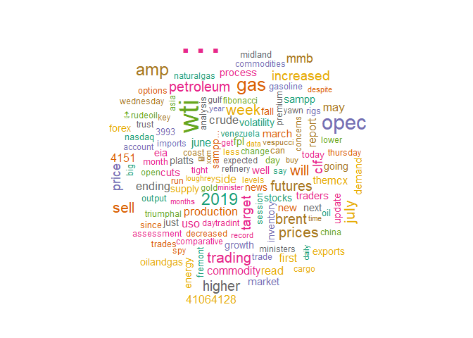
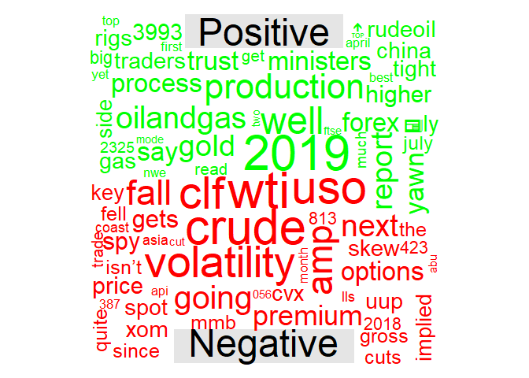
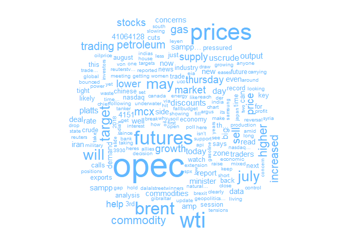
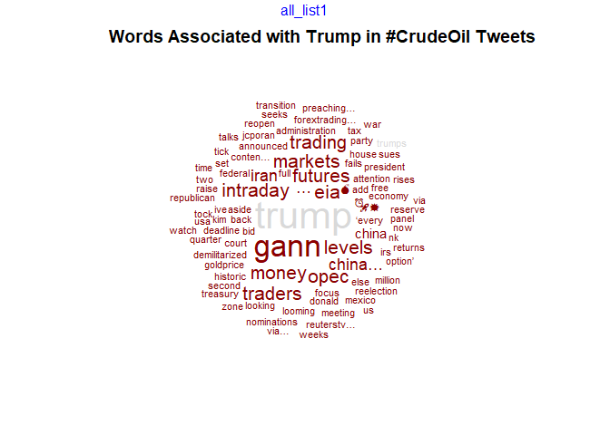
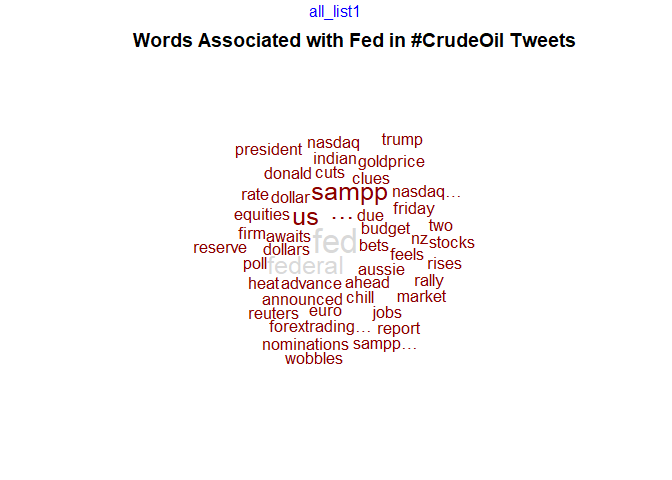

Sentiment Analysis in Crude Oil Markets
================
Last updated as of 2019-07-05

  - [Project Summary](#project-summary)
  - [Package Imports](#package-imports)
  - [Code](#code)
      - [1. Import Text Data](#import-text-data)
      - [2. Text Preprocessing](#text-preprocessing)
      - [3. Exploratory Data Analysis with ggplot and
        wordcloud](#exploratory-data-analysis-with-ggplot-and-wordcloud)
      - [4. Basic Sentiment Analysis with
        qdap::polarity()](#basic-sentiment-analysis-with-qdappolarity)
      - [5. Preprocessing for tidytext](#preprocessing-for-tidytext)
      - [6. Sentiment Analysis with tidytext
        Lexicons](#sentiment-analysis-with-tidytext-lexicons)
      - [7. Comparison Clouds, Commonality Clouds and Pyramind
        Plots](#comparison-clouds-commonality-clouds-and-pyramind-plots)
      - [8. Word Networks with qdap](#word-networks-with-qdap)
      - [9. Final Conclusions](#final-conclusions)

## Project Summary

This project leverages on text data sourced from
[Twitter](https://twitter.com/) in addition to Natural Language
Processing packages in R (E.g.
[qdap](https://www.rdocumentation.org/packages/qdap/versions/2.3.2) and
[tidytext](https://www.rdocumentation.org/packages/tidytext/versions/0.2.0))
to perform basic Sentiment Analysis.

The objective will be to see if applying such methods to Twitter-sourced
text data leads to any interesting insights. Future implementations
might involve the integration of such findings with an algorithmic
trading strategy to take positions based on market sentiment.

## Package Imports

``` r
library(knitr)  # Export R Notebook to R Script
library(qdap)  # Quantitative Discourse Analysis Package
library(RCurl)  # For HTTP Requests
library(stringr)  # For String Manipulation
library(tidytext)  # Natural Language Processing package in R
library(tidyverse)  # For data wrangling
library(tm)  # Text Mining
library(wordcloud)  # Generation of Word Clouds
```

## Code

### 1\. Import Text Data

``` r
crude_df <- read_csv("tweets.csv")
```

### 2\. Text Preprocessing

``` r
# Remove all preceding "RT" characters in Retweeted tweets
crude_df$text <- gsub(pattern = "RT", replacement = "", crude_df$text)

# Remove all Twitter user handles in Retweets
crude_df$text <- gsub(pattern = "@\\w+", replacement = "", crude_df$text)

# Convert all tweets to lower case
crude_df$text <- tolower(crude_df$text)

# Remove punctuation
crude_df$text <- removePunctuation(crude_df$text)

# Remove quotation marks
crude_df$text <- gsub(pattern = '“', replacement = "", crude_df$text)

# Remove URL links
crude_df$text <- gsub("http\\w+", "", crude_df$text)

# Replace contractions
crude_df$text <- replace_contraction(crude_df$text)

# Define a list of uninformative stop-words for removal
crude_stopwords <- c("crudeoil", "Crudeoil", "crude", "oil", "oott", stopwords("en"))

# Remove all stop words
crude_df$text <- removeWords(crude_df$text, crude_stopwords)

# Remove all whitespace
crude_df$text <- stripWhitespace(crude_df$text)

# Examine the text data without stop words
crude_df$text[1:10]
```

    ##  [1] "With domestic output exceeding regional demand us producers increasingly looking toward export m…"               
    ##  [2] "For friday us front 12 months futures prices vwaps go us h session…"                                             
    ##  [3] "Opec pumped 296 mmbpd last month 170 kbd may’s revised figure amp lowest opec total since 2014reuters surve…"    
    ##  [4] "Ships vanishing tracking screens clandestine transfers high seas amp fake destinationshave helped iran continue…"
    ##  [5] "Opec pumped 296 mmbpd last month 170 kbd may’s revised figure amp lowest opec total since 2014reute…"            
    ##  [6] "If state economy improve demand alone likely able slice potentially growing inventori…"                          
    ##  [7] "The army isn’t trader doesn’t sell legally illegally sale exclusive” jurisdiction t…"                            
    ##  [8] "Mcx commodity report evening session gold silver copper "                                                        
    ##  [9] "Ships vanishing tracking screens clandestine transfers high seas amp fake destinationshave helped iran c…"       
    ## [10] "If state economy improve demand alone likely able slice potentially growing …"

The Twitter text data at this point appears to be sufficiently
pre-processed. Next steps in the project will include basic analytics
with wordclouds and ggplot, before moving onto Sentiment Analysis.

### 3\. Exploratory Data Analysis with ggplot and wordcloud

``` r
# Explore the most common words in the data set
crude_df %>%
  unnest_tokens(word, text) %>%
  group_by(word) %>%
  count() %>%
  arrange(desc(n)) %>%
  head(n = 10) %>%
  ggplot(mapping = aes(x = reorder(word, desc(n)), y = n, fill = word)) +
    geom_col() +
    labs(
      title = "Word Frequency in #crudeoil tweets",
      subtitle = paste("Data collected on", Sys.Date()),
      caption = "Source: Twitter API",
      x = "Word",
      y = "Frequency") +
    theme_minimal() +
    theme(legend.position = "none")
```

<!-- -->

``` r
# Generate a simple word cloud on the Twitter data
wordcloud(
  words = crude_df$text, 
  min.freq = 15, 
  colors = brewer.pal(8, "Dark2"), 
  random.color = TRUE, 
  max.words = 250
  )
```

<!-- -->

### 4\. Basic Sentiment Analysis with qdap::polarity()

Next, apart from simple word counts, we want to roughly estimate the
“polarity” or emotion of the collection of tweets. To do this, we use
the polarity() function from the qdap package.

``` r
# Define a Polarity Object for the set of #crudeoil tweets
crude_polarity <- polarity(crude_df$text)

# Print a summary of the polarity object
summary(crude_polarity$all$polarity)
```

    ##     Min.  1st Qu.   Median     Mean  3rd Qu.     Max.     NA's 
    ## -1.06066  0.00000  0.00000 -0.01881  0.00000  0.90453        9

``` r
# Visualize the polarity object with ggplot
ggplot(crude_polarity$all, aes(x = polarity, y = ..density..)) +
  geom_histogram(binwidth = 0.25, fill = "#bada55", colour = "grey60") +
  geom_density(color = "darkblue") +
  labs(
    title = "qdap Polarity Scores of #crudeoil tweets",
    subtitle = paste("As of", Sys.Date()),
    caption = "Source: Twitter API",
    x = "Polarity Score",
    y = "Frequency"
  )
```

<!-- -->

A rough analysis of all tweets in the dataset does not suggest that
sentiment in this space skews either left or right. Most observations
appear to return a polarity score of 0, although the mean does appear to
tilt to the left (i.e. negativity).

Further analysis on sentiment will be attempted by joining a pre-loaded
Lexicon of sentiment and repeating the analysis.

### 5\. Preprocessing for tidytext

Another method of drawing sentiment from textual data involves using the
tidytext package and its associated lexicons (E.g. NRC, AFINN and Bing).
In this following section, we perform an inner-join of our crude data to
the lexicons and attempt to draw further insights.

``` r
# Store a character vector containing all tweets
tweet_vector <- crude_df$text

# Examine the vector
head(tweet_vector)
```

    ## [1] "With domestic output exceeding regional demand us producers increasingly looking toward export m…"               
    ## [2] "For friday us front 12 months futures prices vwaps go us h session…"                                             
    ## [3] "Opec pumped 296 mmbpd last month 170 kbd may’s revised figure amp lowest opec total since 2014reuters surve…"    
    ## [4] "Ships vanishing tracking screens clandestine transfers high seas amp fake destinationshave helped iran continue…"
    ## [5] "Opec pumped 296 mmbpd last month 170 kbd may’s revised figure amp lowest opec total since 2014reute…"            
    ## [6] "If state economy improve demand alone likely able slice potentially growing inventori…"

``` r
# Convert the character vector into a Volatilte Corpus
tweet_corpus <- VCorpus(VectorSource(tweet_vector))

# Convert the corpus into a Document Term Matrix
tweet_dtm <- DocumentTermMatrix(tweet_corpus)
tweet_dtm_matrix <- as.matrix(tweet_dtm)

# Examine the Document Term Matrix
str(tweet_dtm_matrix)
```

    ##  num [1:1000, 1:2820] 0 0 0 0 0 0 0 0 0 0 ...
    ##  - attr(*, "dimnames")=List of 2
    ##   ..$ Docs : chr [1:1000] "1" "2" "3" "4" ...
    ##   ..$ Terms: chr [1:2820] "‘every" "’ve" "<U+0001D5D6>rudeoil" "<U+0001D5D6>rudeoiln" ...

Appropriately, we get a Document Term Matrix with 1000 rows
(representing the 1000 tweets that were queried) and 2441 columns
(representing 2441 unique terms that were found in the dataset).

``` r
# Tidy the Document Term Matrix for tidytext analysis
tidy_tweets <- tidy(tweet_dtm)

# Examine the tidied dataset
head(tidy_tweets)
```

    ## # A tibble: 6 x 3
    ##   document term         count
    ##   <chr>    <chr>        <dbl>
    ## 1 1        demand           1
    ## 2 1        domestic         1
    ## 3 1        exceeding        1
    ## 4 1        export           1
    ## 5 1        increasingly     1
    ## 6 1        looking          1

The second stage of preprocessing gives us a “tidy dataset” i.e. a data
structure that abides by “tidyverse” conventions. By having “term” as a
column, this gives us the opportunity to join a sentiment lexicon in the
next stage to draw insights about the sentiment of the dataset.

### 6\. Sentiment Analysis with tidytext Lexicons

``` r
# Store the "Bing" lexicon from tidytext
bing <- get_sentiments(lexicon = "bing")

# Inner join the Bing lexicon to the Document Term Matrix and generate a Polarity Score
tweet_polarity_bing <-
  tidy_tweets %>% 
  inner_join(bing, by = c("term" = "word")) %>% 
  mutate(index = as.numeric(document)) %>% 
  count(sentiment, index) %>% 
  spread(sentiment, n, fill = 0) %>% 
  mutate(polarity = positive - negative)

# Examine the mutated dataset
str(tweet_polarity_bing)
```

    ## Classes 'tbl_df', 'tbl' and 'data.frame':    482 obs. of  4 variables:
    ##  $ index   : num  1 4 6 7 8 9 10 12 14 15 ...
    ##  $ negative: num  0 1 0 1 0 1 0 0 0 0 ...
    ##  $ positive: num  1 1 1 0 1 1 1 1 1 1 ...
    ##  $ polarity: num  1 0 1 -1 1 0 1 1 1 1 ...

``` r
# Plot Polarity Scores against Index
ggplot(data = tweet_polarity_bing, aes(rev(index), polarity)) +
  geom_smooth() +
  labs(
    title = "Polarity of #CrudeOil tweets (With Bing Lexicon)",
    caption = "Source: Twitter API, Bing Lexicon",
    x = "Time",
    y = "Polarity"
  ) +
  theme_minimal()
```

    ## `geom_smooth()` using method = 'loess' and formula 'y ~ x'

<!-- -->

``` r
# Store the "AFINN" lexicon from tidytext
afinn <- get_sentiments(lexicon = "afinn")

# Inner join the AFINN lexicon to the Document Term Matrix and generate a Polarity Score
tweet_polarity_afinn <-
  tidy_tweets %>% 
  inner_join(afinn, by = c("term" = "word")) %>% 
  mutate(index = as.numeric(document)) %>%
  count(value, index) %>% 
  group_by(index) %>% 
  summarize(polarity = sum(value * n))

# Examine the mutated dataset
head(tweet_polarity_afinn)
```

    ## # A tibble: 6 x 2
    ##   index polarity
    ##   <dbl>    <dbl>
    ## 1     1       -1
    ## 2     3       -1
    ## 3     4       -3
    ## 4     5       -1
    ## 5     6        0
    ## 6     7        1

``` r
# Plot Polarity Scores against Index
ggplot(data = tweet_polarity_afinn, aes(rev(index), polarity)) +
  geom_smooth() +
  labs(
    title = "Polarity of #CrudeOil tweets (With AFINN Lexicon)",
    caption = "Source: Twitter API, AFINN Lexicon",
    x = "Time",
    y = "Polarity"
  ) +
  theme_minimal()
```

    ## `geom_smooth()` using method = 'loess' and formula 'y ~ x'

<!-- -->

``` r
# Store the "Loughran-Macdonald" Sentiment Lexicon from tidytext
loughran <- get_sentiments(lexicon = "loughran")

# Inner join the Bing lexicon to the Document Term Matrix and generate a Polarity Score
tweet_polarity_loughran <-
  tidy_tweets %>% 
  inner_join(loughran, by = c("term" = "word")) %>% 
  mutate(index = as.numeric(document)) %>% 
  group_by(sentiment) %>% 
  summarize(count = sum(count))

# Examine the mutated dataset
head(tweet_polarity_loughran)
```

    ## # A tibble: 5 x 2
    ##   sentiment    count
    ##   <chr>        <dbl>
    ## 1 constraining     6
    ## 2 litigious       24
    ## 3 negative       245
    ## 4 positive        87
    ## 5 uncertainty    100

``` r
# Plot a distribution of sentiments
ggplot(tweet_polarity_loughran, aes(x = reorder(sentiment, desc(count)), y = count, fill = sentiment)) +
  geom_col() +
  labs(
    title = "Polarity of #CrudeOil tweets (With Loughran-Macdonald Lexicon)",
    caption = "Source: Twitter API, Loughran-Macdonald Lexicon",
    x = "Sentiment",
    y = "Count"
  ) +
  theme(legend.position = "none") +
  theme_minimal()
```

<!-- -->

### 7\. Comparison Clouds, Commonality Clouds and Pyramind Plots

In this final section, we split the tweet data into Positive and
Negative baskets and draw out the most frequent terms per category.

To do so, we structure the data as a Term Document Matrix instead of a
Document Term Matrix as a we did
before.

``` r
# Extract all "positive-sentiment" tweets and collapse into a single string
pos_terms <-
  crude_df %>% 
  mutate(polarity = polarity(text)$all$polarity) %>% 
  filter(polarity > 0) %>% 
  pull(text) %>% 
  paste(collapse = " ")

# View the joined string
substr(pos_terms, 1, 100)
```

    ## [1] "With domestic output exceeding regional demand us producers increasingly looking toward export m… If"

``` r
# Extract all "negative-sentiment" tweets and collapse into a single string
neg_terms <-
  crude_df %>% 
  mutate(polarity = polarity(text)$all$polarity) %>% 
  filter(polarity < 0) %>% 
  pull(text) %>% 
  paste(collapse = " ")

# View the joined string
substr(neg_terms, 1, 100)
```

    ## [1] "Ships vanishing tracking screens clandestine transfers high seas amp fake destinationshave helped ir"

``` r
# Concatenate the two strings into a vector with 2 elements
all_terms <- c(pos_terms, neg_terms)

# Convert the vector into a Corpus
corpus_all_terms <- VCorpus(VectorSource(all_terms))

# Convert the Corpus into a TermDocumentMatrix
tdm_all_terms <- TermDocumentMatrix(
  corpus_all_terms,
  control = list(
    weighting = weightTf,
    removePunctuation = TRUE
  )
)

# Convert the TDM into an R matrix object
matrix_all_terms <- as.matrix(tdm_all_terms)
colnames(matrix_all_terms) <- c("Positive", "Negative")

# View the TDM Matrix
tail(matrix_all_terms)
```

    ##            Docs
    ## Terms       Positive Negative
    ##   year             0        2
    ##   years            1        1
    ##   yet              6        1
    ##   yields           0        1
    ##   yimoulee…        0        1
    ##   zone             4        3

``` r
# Plot a Comparison Cloud with the tidied TDM
comparison.cloud(matrix_all_terms, colors = c("green", "red"))
```

<!-- -->

``` r
commonality.cloud(matrix_all_terms, colors = "steelblue1")
```

<!-- -->

``` r
# Create a data.frame containing 25 of the most common terms to compare
top15_terms <-
  matrix_all_terms %>% 
  as_tibble(rownames = "word") %>% 
  filter_all(all_vars(. > 0)) %>% 
  mutate(difference = Positive - Negative) %>% 
  top_n(15, wt = difference) %>% 
  arrange(desc(difference))

# Examine the top 25 terms
head(top15_terms)
```

    ## # A tibble: 6 x 4
    ##   word       Positive Negative difference
    ##   <chr>         <dbl>    <dbl>      <dbl>
    ## 1 well             24        3         21
    ## 2 production       20        1         19
    ## 3 report           19        3         16
    ## 4 higher           19        7         12
    ## 5 petroleum        18        6         12
    ## 6 gas              17        6         11

``` r
# Create a Pyramid Plot to visualize the differences
library(plotrix)

pyramid.plot(
  top15_terms$Positive,
  top15_terms$Negative,
  labels = top15_terms$word,
  top.labels = c("Positive", "Word", "Negative"),
  main = "Words in Common",
  unit = NULL,
  gap = 10,
  space = 0.2
)
```

<!-- -->

    ## [1] 5.1 4.1 4.1 2.1

### 8\. Word Networks with qdap

A final form of analysis can tell us what words are most associated with
a pre-defined word. We do this with the word\_associate() function in
qdap which can generate network graphs and/or word clouds around this
form of analysis.

``` r
# Create a Word Network plot with qdap'
word_associate(
  crude_df$text, 
  match.string = c("trump"), 
  stopwords = c("crude", stopwords("en")), 
  wordcloud = TRUE, 
  cloud.colors = c("gray85", "darkred"),
  nw.label.proportional = TRUE
  )
```

    ##    row group unit                                   text                                                                                             
    ## 1   55   all   55                                     Crude intraday gann levels trading money futures gann markets traders eia opec trump china…    
    ## 2   65   all   65                                     Watch trump kim reopen talks historic meeting demilitarized zone …                             
    ## 3   93   all   93                                         With court deadline looming trump administration looking ‘every option’ seeks add conten…  
    ## 4  557   all  557                                   Goldprice rises us president donald trump announced two nominations federal reserve forextrading…
    ## 5  665   all  665                                   Crude intraday gann levels trading money futures gann markets traders eia opec trump china iran …
    ## 6  673   all  673                                     House panel sues treasury irs trumps tax returns via reuterstv…                                
    ## 7  680   all  680                                     Trump republican party raise 105 million second quarter reelection bid via…                    
    ## 8  683   all  683                                     Crude intraday gann levels trading money futures gann markets traders eia opec trump china…    
    ## 9  856   all  856                                     Trump set aside china nk mexico usa now free focus full attention iran ive preaching…          
    ## 10 932   all  932 When else fails time transition back war economy <U+0001F4A3> <U+0001F680><U+0001F4A5> tick tock <U+23F0> 6 weeks trump iran jcpoa…
    ## 11 939   all  939                                     Crude intraday gann levels trading money futures gann markets traders eia opec trump china…

    ## 
    ## Match Terms
    ## ===========

    ## 
    ## List 1:
    ## trump, trumps

    ## 

``` r
title(main = "Words Associated with Trump in #CrudeOil Tweets")
```

<!-- -->

``` r
# Create a Word Network plot with qdap'
word_associate(
  crude_df$text, 
  match.string = c("fed"), 
  stopwords = c("crude", stopwords("en")), 
  wordcloud = TRUE, 
  cloud.colors = c("gray85", "darkred"),
  nw.label.proportional = TRUE
  )
```

    ##   row group unit text                                                                                             
    ## 1  64   all   64   Aussie nz dollars chill fed feels heat reuters poll …                                          
    ## 2 100   all  100   Dollar firm market awaits us jobs report fed clues sampp…                                      
    ## 3 310   all  310   Stocks rally bets fed rate cuts euro wobbles sampp nasdaq…                                     
    ## 4 557   all  557 Goldprice rises us president donald trump announced two nominations federal reserve forextrading…
    ## 5 685   all  685   Most indian equities advance ahead federal budget due friday sampp nasdaq …

    ## 
    ## Match Terms
    ## ===========

    ## 
    ## List 1:
    ## fed, federal

    ## 

``` r
title(main = "Words Associated with Fed in #CrudeOil Tweets")
```

<!-- -->

### 9\. Final Conclusions

This project attempted to leverage on key NLP libraries in R to derive
new insights about market sentiment in the Crude Oil market.

By using a variety of Sentiment Lexicons, we found that, on average,
sentiment for tweets tagged with \#crudeoil tended towards the negative.
This was unsurprising considering geopolitical developments around the
U.S. and Iran, and the effect that those events have on the supply of
crude oil.

Interestingly, we note that *price action* for Crude Oil in this
timeframe was *overwhelmingly bullish*. (Note only was there the looming
threat of war cutting off crude supplies, but the Fed’s dovish outlook
also provided support for prices). This suggests that a naive
interpretation of using negative sentiment to take bearish positions is
overwhelmingly simplistic.

Future projects could involve the transformation of such sentiment data
into an algorithmic trading strategy with packages such as ‘quanstrat’.

``` r
# Export the analysis to an R Script
purl("crude-oil-sentiment-analysis.Rmd")
```

    ## [1] "crude-oil-sentiment-analysis.R"
